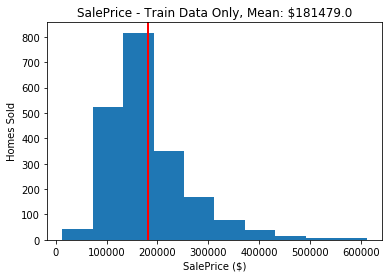
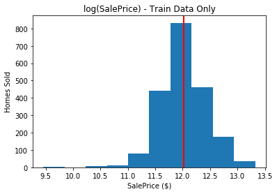
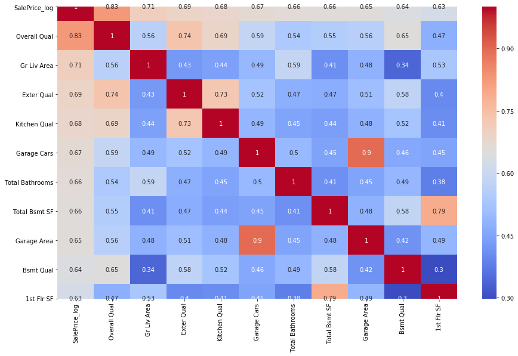
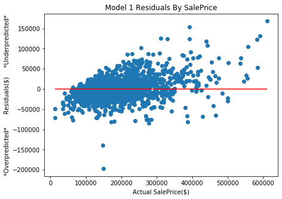
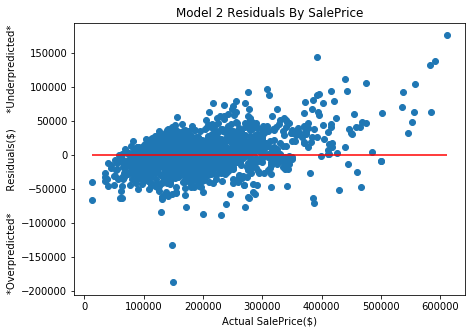
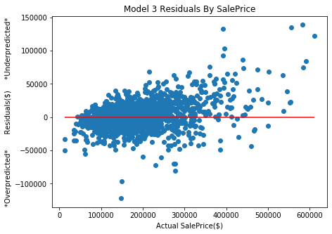

# Predicting Sale Price for Ames Iowa Housing Dataset
#### By: [Anthony Lucci](https://git.generalassemb.ly/anthonylucci?tab=repositories)

## Table of Contents
1. [Problem Statement](#Problem-Statement)
1. [Executive Summary](#Executive-Summary)
1. [Feature Engineering](#Feature-Engineering)
1. [Model Residuals](#Model-Residuals)
1. [References](#References)

## Problem Statement

This projects seeks to create a regression model that can predict home sale prices in Ames, IA with similar accuracy to [Zillow's Zestimate](https://www.zillow.com/zestimate/) model. Zillow consumes a plethora of data into their model:
- Home details (bedrooms, square footage, etc.)
- Unique features (marble counters, pool house, etc.)
- On-market data (comparable homes listed/sold in area, etc.)
- Off-market data (tax assessments, foreclosures, etc.)
Zillow Zestimate's median %error on home sale prices in Iowa is +/-1.4%. This project will seek to match or beat that by building a regression model against the Ames Assessor Data for the period 2006-2010. The models will be optimized against root mean squared error (RMSE), and RMSE will be calculated as a % of mean sale price to compare against Zestimate.

## Executive Summary
The Ames Assessor Data featured a plethora of categorical columns that needed extensive transformation to be ready for analysis. This categorical data is specific to Ames and provided predictive power in the model that Zillow does not have. Theoretically, this should be an adavantage for our model. Working against us was the fact that the Ames dataset does not have off-market data, does not account for the price of nearby homes, and the fact that we are predicting with a single fitted model. Zillow almost surely uses an ensemble model that has been fine-tuned over the course of years by a large team.

|Model|Train R2|Test R2|RMSE|Pct RMSE of mean*|
|---|---|---|---|---|
|Baseline: Just using mean SalePrice|||80,629||
|Model 1: MLR w/ Continuous Variables|0.8505|0.8560|25,854|14.2 pct|
|Model 2: MLR w/ Continuous Variables|0.8690|0.8820|23,939|13.2 pct|
|Model 3: Lasso w/ Full Numeric Set|0.9293|0.9175|18,951|10.4 pct|

None of the models had an R2 below 0.85 and all had low variance (<0.02 difference between train and test). The Lasso model outperformed all others, and was the one submitted to Kaggle. It explained approx. 92 percent of the variance in home sale prices.

The two variables most correlated with home sale price were Overall Quality and Greater Living Area. Overall quality is a subjective measure determined by the Ames assessor, and greater living area is an approximation of livable sqaure footage. It is unfortunate that the error of the Lasso model was only able to come within +/-10% of sale price despite an R2 of 0.92.

Log(SalePrice) was used as the dependent variable in all models because the raw sale prices had very high kurtosis.

*Mean home sale price in Ames train set: $181,479

## Feature Engineering
Histogram of SalePrice from train set (very high kurtosis):

Histogram of log(SalePrice) from train set (normal kurtosis; <3):

Heatmap of correlation matrix for top 10 most correlated variables:

## Model Residuals
Model 1:

Model 2:

Model 3:

## References

- https://www.zillow.com/zestimate/

